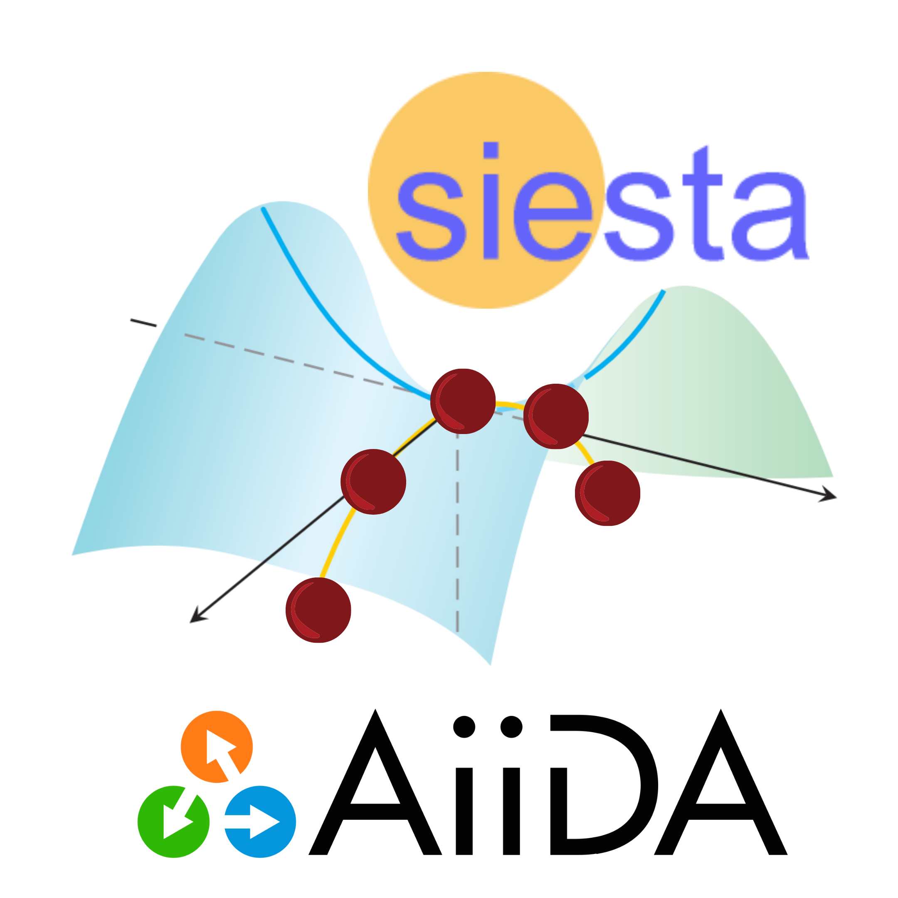

Welcome to the AiiDA-Siesta-barrier documentation!
++++++++++++++++++++++++++++++++++++++++++++++++++

Collects aiida workflows to calculate energy barriers. Based on the Nudged Elastic Band method. Requires `aiida-siesta` package.

Acknowledgments:
----------------

This work is supported by the `MaX
European Centre of Excellence <http://www.max-centre.eu/>`_ funded by
the Horizon 2020 INFRAEDI-2018-1 program, Grant No. 824143, and by the
`INTERSECT <https://intersect-project.eu/>`_  (Interoperable material-to-device simulation box for
disruptive electronics) project, funded by Horizon 2020 under grant
agreement No 814487, as well as by the Spanish MINECO (projects
FIS2012-37549-C05-05 and FIS2015-64886-C5-4-P)

We thank the AiiDA team, who are also supported by the `MARVEL National Centre for Competency in Research <http://nccr-marvel.ch>`_
funded by the `Swiss National Science Foundation <http://www.snf.ch/en>`_

.. figure:: miscellaneous/logos/MaX.png
    :alt: MaX
    :target: http://www.max-centre.eu/

.. figure:: miscellaneous/logos/MARVEL.png
    :alt: MARVEL
    :target: http://nccr-marvel.ch

Contents:
---------

Some Background
===============

.. toctree::
   :maxdepth: 4

   somebackground 

Installation
============

.. toctree::
   :maxdepth: 4

   installation

Workflows
=========

.. toctree::
   :maxdepth: 4

   workflows/index
