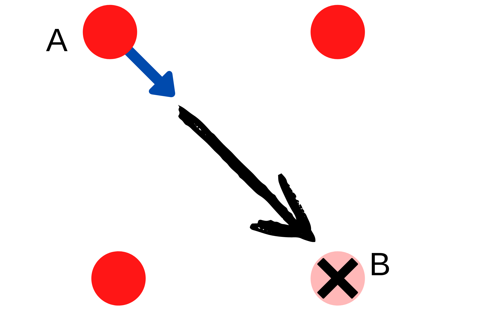
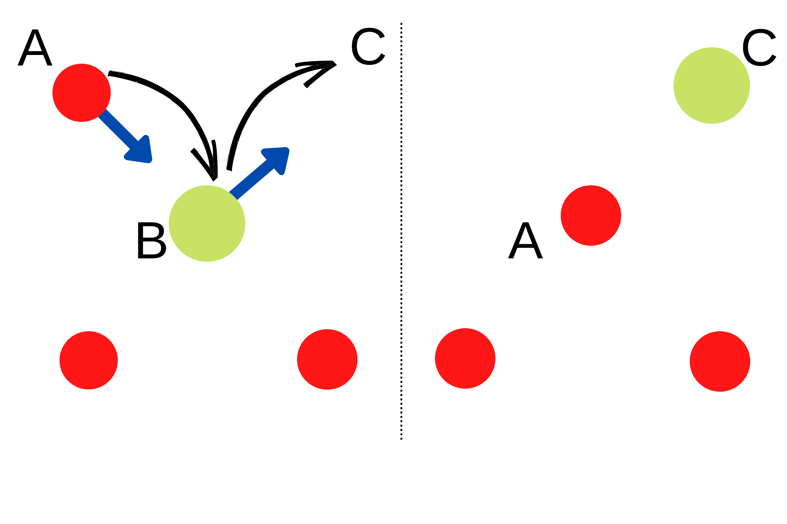
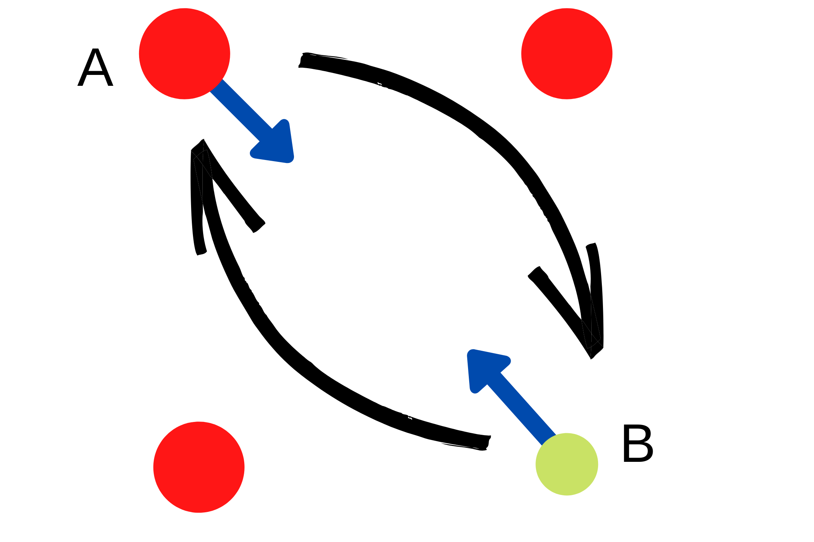
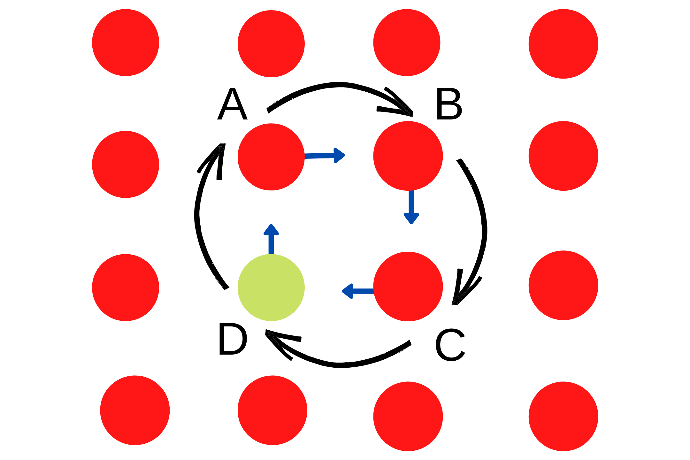

Diffusion/Barriers
++++++++++++++++++

Diffusion is a description of the way in which atoms, ions, or molecules flow through a surrounding medium. There are two overriding considerations to keep in mind when discussing diffusion in solids: the structure of the matrix across which diffusion occurs and the defects present. In a normal crystalline solid, diffusion is mediated by the defects present, and the speed of diffusion will vary significantly if the predominant defect type changes. This is because diffusion involves the movement of a species from a stable position, through some sort of less stable position or bottleneck, to another stable position. Any disorder in the solid due to defects will make this process easier.

There are five types of :

1. Vacancy & Interstitial Diffusion
2. Kick Diffusion
3. Exchange & Vacancy Exchange
4. Ring or n-Exchange
5. Switching (Manual)

Defects Diffusion Types
-----------------------
Vacancy & Interstitial Diffusion
^^^^^^^^^^^^^^^^^^^^^^^^^^^^^^^^

We could imagine a crystal such as that of a metal in which all of the atom sites are occupied. Inherently, diffusion from one normally occupied site to another would be impossible in such a crystal and a random walk cannot occur at all. However, diffusion can occur if a population of defects such as vacancies exists. In this case, atoms can jump from a normal site into a neighboring vacancy and so gradually move through the crystal. Movement of a diffusing atom into a vacant site corresponds to movement of the vacancy in the other direction Figure below.

In the case of interstitials—self-interstitials, impurities, or dopants—two diffusion mechanisms can be envisaged. In the simplest case, an interstitial can jump to a neighboring interstitial position Figure above. This is called interstitial diffusion and is some times referred to as direct diffusion to distinguish it from vacancy diffusion (indirect diffusion). Diffusion paths between the tetrahedral sites form the edges of a truncated octahedron. As one example, diffusion parallel to a cubic axis is possible if the diffusing interstitial jumps between alternating octahedral–tetrahedral sites.

Kick Diffusion
^^^^^^^^^^^^^^

An alternative mechanism by which interstitial atoms can diffuse involves a jump to a normally occupied site together with simultaneous displacement of the occupant into a neighboring interstitial site. This knock-on process is called interstitialcy diffusion. Finally, an interstitial impurity can move onto a normal lattice site by interstitialcy diffusion, leaving a self-interstitial and a substitutional defect in its place. This is called the kick-out mechanism.

Exchange & Vacancy Exchange
^^^^^^^^^^^^^^^^^^^^^^^^^^^

Substitutional impurities can move by way of a number of mechanisms. The most usual is the vacancy mechanism described above (Ring or n-Exchange Section). Diffusion studies on semiconductors have suggested that a number of additional mechanisms might hold.

Ring or n-Exchange
^^^^^^^^^^^^^^^^^^

as well as vacancy diffusion, an impurity can swap places with a neighboring normal atom,exchange diffusion, while in ring diffusion cooperation between several atoms is needed to make the exchange.

